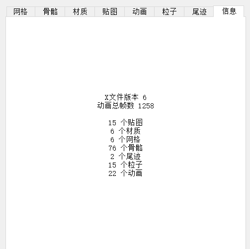
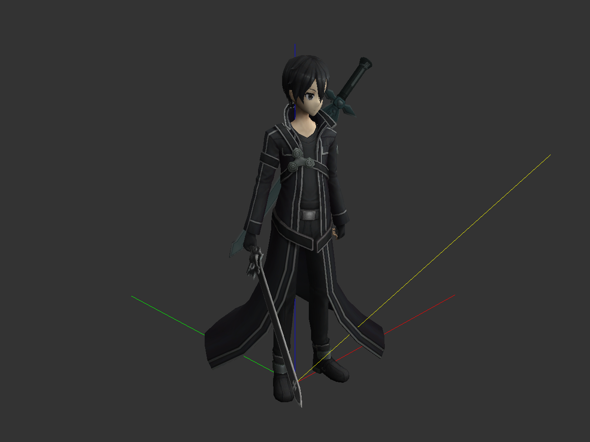
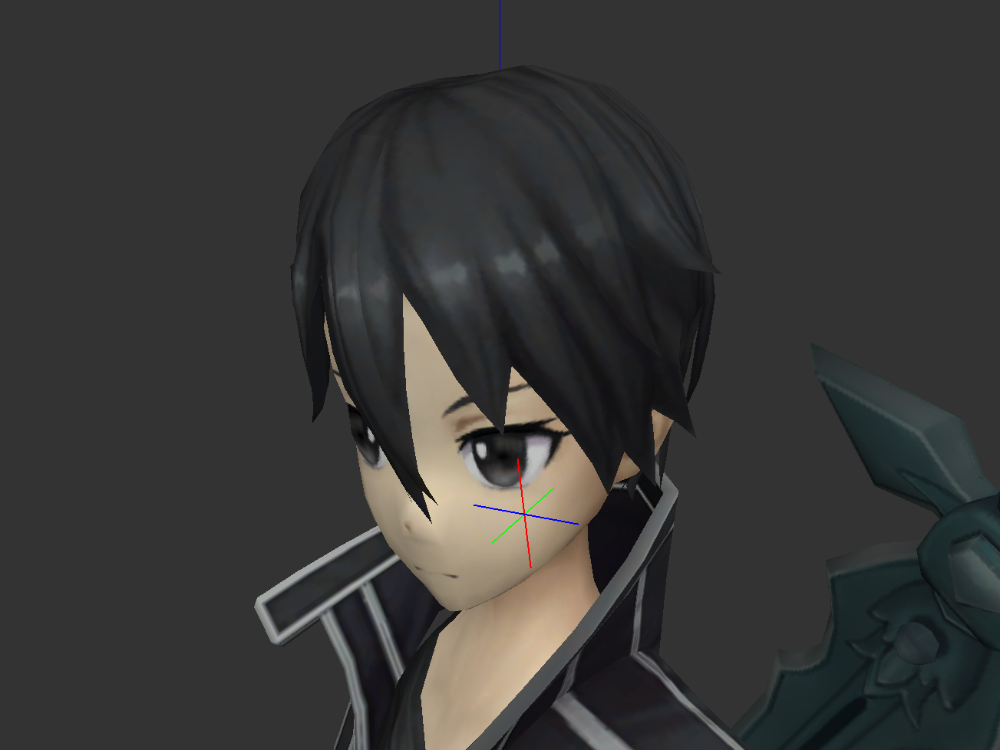
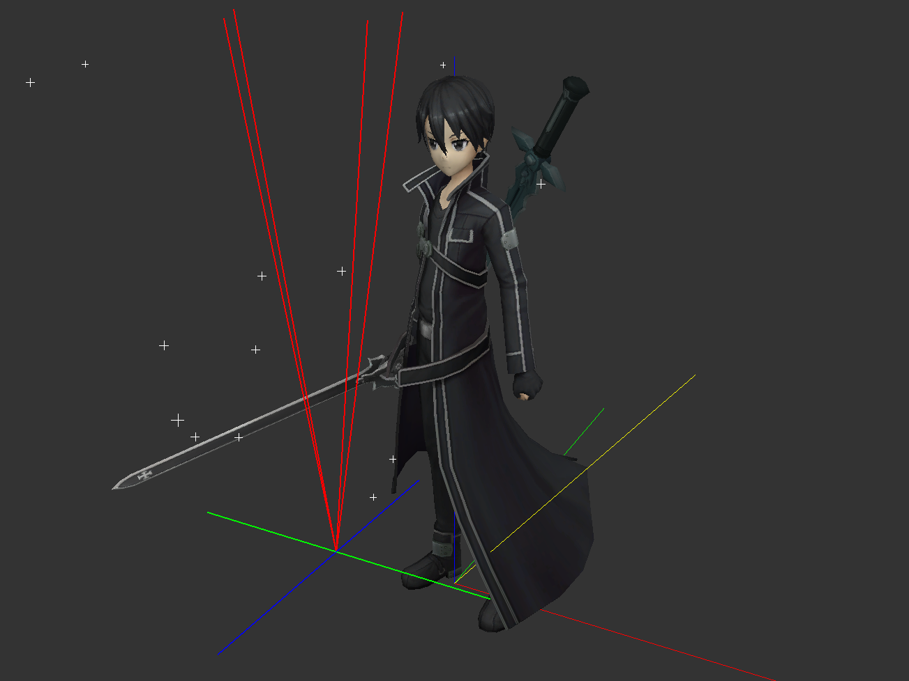
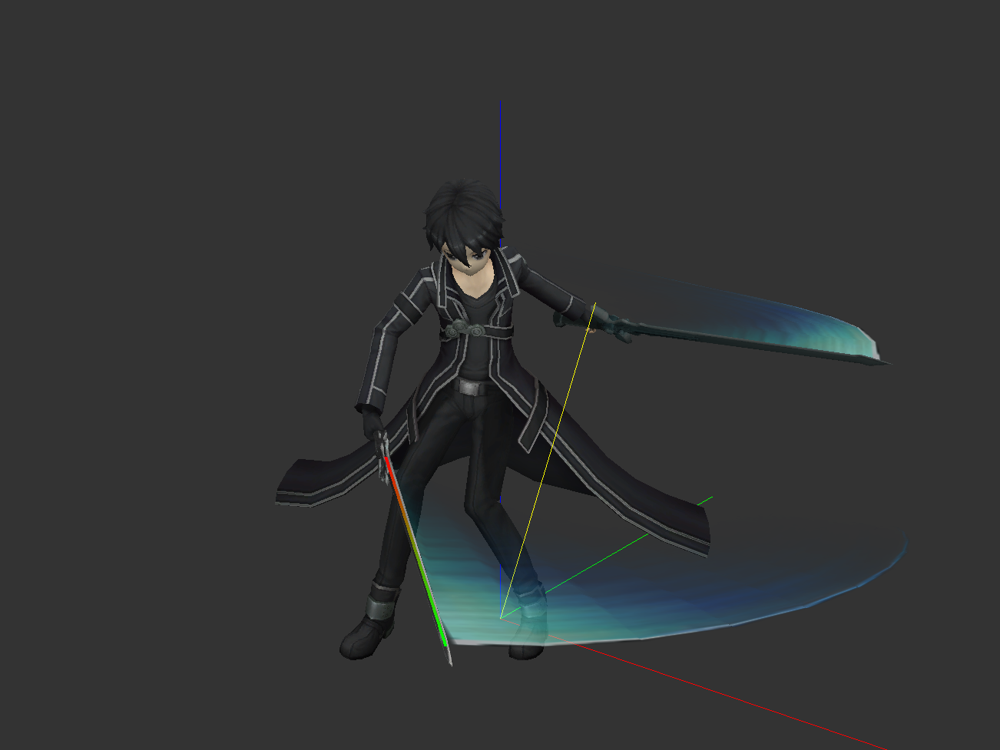
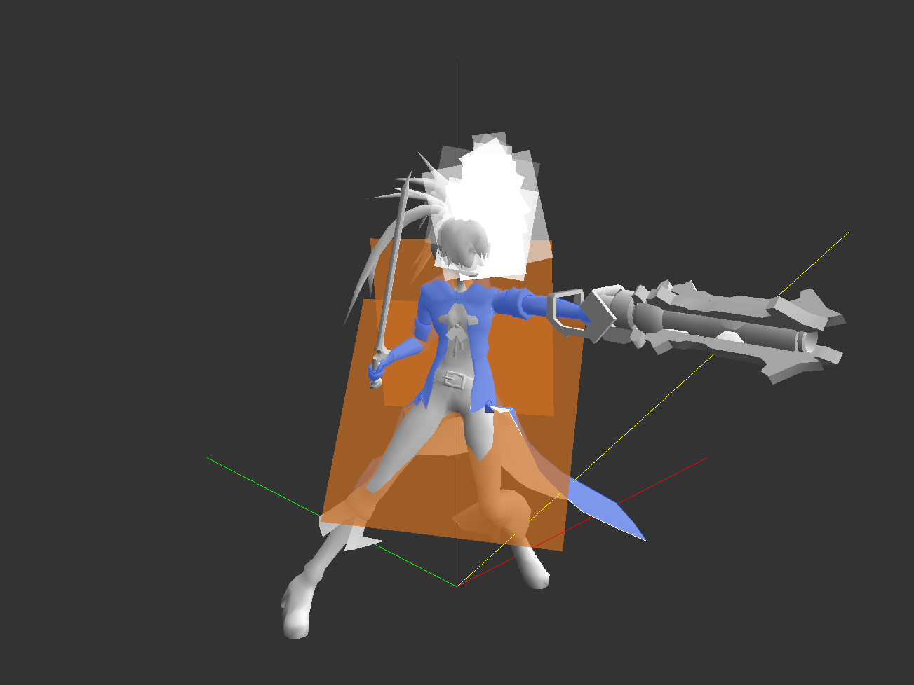

# 软件界面与基础功能

## X模型文件简介

一个完整的X模型包含有网格、材质、贴图、骨骼、动画、粒子、尾迹七种元素。所有在游戏中的可见内容都由这七种元素构成。

需要注意的是，这里的动画元素仅决定了每一个动画片段的起始与终止帧数，并不保存实际的动画数据。动画数据保存于骨骼和材质中。

## 软件界面简介

### 软件左方标签栏

打开一个X文件之后，可以在信息栏看到此文件的统计数据：

* X文件版本：目前编辑器支持的版本包括6、7、8。6为目前大多数X文件的版本，8为部分新英雄文件的版本，此外还有部分老英雄模型与特效版本为5，无法编辑。
* 动画总帧数：保存在骨骼与材质中的动画数据的最大帧数，修改动画的帧数时请注意不要超过此数值，超过后会造成模型无动画的结果。

除信息栏外剩余的七个栏目，每个对应该文件内一种元素的列表。单击可以选中一个元素，在预览窗口内观察该元素作用的部分。单击空白处可取消选择，选择后Delete键可以删除元素。在元素上右键可以查看可对当前元素进行的操作，编辑即为调整元素的各项参数。

### 软件右方预览窗口

软件右方即为该文件效果的预览，默认还包括四条线段：红色、绿色、蓝色三条线段显示了XYZ坐标系的轴向，线段长度均为100单位。黄色线段显示了当前光照的方向，用于预览模型接收光照的效果。

**注意，此处显示的效果仅为实际游戏内效果的近似，有些参数调整需进入游戏才能生效，一切参数修改效果请均以游戏内效果为准！**

在预览窗口内，左键拖动即可改变观察模型的角度，鼠标滚轮可调整观察距离，中键拖动可调整观察视角的Z方向坐标，右键拖动可改变黄色线段的方向。

#### 选择元素的预览效果

* 选择网格、材质、贴图的效果均为使与当前选择有关的网格元素显示为红色。
* 选择骨骼的效果为在骨骼所在处显示一个局部坐标系。红色、绿色、蓝色线段分别为当前骨骼坐标系的XYZ轴向。

* 选择动画的效果为播放当前选择的动画片段。
* 选择粒子的效果为在粒子所在处显示如下结构：

	* 红色线段显示了粒子的发射方向，四条红色线段显示了该粒子的随机发射角度，若随机角度为零则只显示一条红色线段。红色线段的长度代表了粒子的发射速度。
	* 蓝色和绿色线段显示了粒子的初始随机偏移。粒子的发射起点并不是固定的一个点，而是由蓝绿线段所构成平面内的随机点。平面的大小由粒子参数随机偏移决定，显示为蓝绿线段的长度。具体粒子的参数将在之后讲解。
	* 此外，发射粒子位置的预览将显示为移动的十字形状。十字线段的长度反映了该粒子的大小，十字的颜色反应该粒子的颜色，十字的旋转情况同理。

* 选择尾迹的效果为显示一条红绿渐变的线段：

线段的红端对应了尾迹的尾部，对应贴图的下方；绿端对应了尾迹的头部，对应贴图的上方。

#### 调整部分元素的显示

* 显示骨骼：将每个骨骼都显示为白色的坐标轴形状。
* 显示线框：将网格、粒子与尾迹显示为边框效果，用于观察网格的布线情况。
* 显示法线：将网格的法线显示为绿色的线段，用于观察模型法线是否正常。
* 显示贴图（默认勾选）：显示网格、粒子与尾迹的贴图，取消勾选则显示材质、粒子、尾迹自身的颜色，可以用于查看材质是否自带颜色。

* 显示网格（默认勾选）：取消勾选则隐藏红绿蓝黄四条线段。
* 播放动画（默认勾选）：取消勾选则在未选择动画时显示模型的绑定姿势（T-pose）。

### 软件上方菜单栏

#### 合并功能

用于合并两个不同的X文件，用于向当前文件引入新元素而无需重新转换和导出整个文件。合并之后的文件将包含两个X文件的全部元素，但是需要注意单个X文件的骨骼数量上限为255，超出会带来意想不到的问题。

合并两个动画帧数不同的文件将使合并后文件的动画帧数为两者中的较大者，帧数不足的部分将以最后一帧的内容加以填充。

**这是新版编辑器的精髓与核心，合理使用可以完成各种之前无法做到的操作。**

#### 动画模板

为了方便动画帧数的编辑，保存动画模板将会把此文件中所有动画的帧数数据（动画名称、起始帧数、终止帧数）保存为一个json文件，用于在另一个X文件中加载相同的帧数数据。注意导入动画模板将会清除当前的动画数据！

#### 整体模型变换

整体平移将使当前文件的所有元素平移相同的距离，输入方法为将XYZ方向的移动距离以英文分号分隔。例如我希望将模型向X方向平移10单位，向Z方向平移-20单位，Y方向不变，则输入如下：

> 10;0;-20

整体旋转将使所有元素沿指定轴按右手系旋转指定的角度，输入方式类似于整体平移，但是推荐一次仅沿一个轴旋转。例如我希望将模型绕X轴旋转45度，则输入如下：

> 45;0;0

整体缩放将使所有元素以原点为中心缩放，输入为一个浮点数，1.0为模型原本大小。如希望将模型放大为原本的两倍，则输入2.0。注意此功能可能会给部分特效的绑定位置带来bug，如可能请尽量用修改ini或dat的方式代替。

裁剪动画帧数将舍弃区间之外的动画数据。如希望保留100到200帧并舍弃其余帧数，则输入为：

> 100;200

注意裁剪后原本的100到200帧将成为0到100帧，需要修改相应的动画帧数。输入的帧数需要注意不超过文件最大动画帧数。