# 网格渲染相关参数

教程仅讲解各个参数单独作用的效果，各种组合效果还请各位补丁作者自行修改测试。

## 贴图

贴图作为一种基本元素，对应了游戏内的一张dds图片，可以被材质、粒子和尾迹所引用，以显示相应的纹理效果。其可编辑的参数仅有一项，便是贴图文件的文件名。文件名后缀可以是dds或tga，大小写均可，但是不可没有后缀。进入游戏之后后缀会被自动替换为dds，所以所有贴图文件都需存储为dds格式。

在编辑器外修改过贴图之后，在贴图栏内右键、刷新即可更新贴图，无需重新打开文件。

### 加载路径

游戏寻找贴图文件的路径包含固定的搜索路径，即我们在前言部分添加的默认搜索路径：`..\data\magic\texture\`下的各个子目录。填写此处的贴图名称游戏便可寻找到此贴图并加载。除此之外，便需要将贴图文件与X文件置于同一个目录，这时填入贴图名称即可被游戏加载。

### 命名规范

对于新加入的额外贴图路径，不推荐使用容易重名的文件名，如`head.dds`，`body.dds`等，尤其是使用中文命名。推荐的命名方式为在文件名前方加上英雄id等能够将不同补丁区分开来的前缀，比如`102_head.dds`，`102_skin1_body.dds`。这种方法可以避免不相关补丁之间的命名冲突。

## 材质

材质是所有基本元素中唯一没有独立命名的元素（雾）。

### Alpha 混合

对应旧版编辑器的“是否为特效”。此项设置的效果比较复杂，一般制作特效时勾选此项，人物模型则不勾选。此选项的效果包括：

- 使用此材质的网格将不会产生阴影。
- 使用贴图的Alpha通道决定透明度。
- 禁用网格的深度缓存，使在其之后进行渲染的网格不会被其所遮挡，用于透明或半透明的网格。

### Alpha测试

对应旧版编辑器的“使用贴图Alpha”。此项设置效果为使网格渲染时使用贴图的透明通道。一般在启用“是否为特效”时无需勾选此项，因为透明通道已自行生成。此选项主要用于一些有透明的非特效网格，如诗乃飘动的围巾上的孔洞。

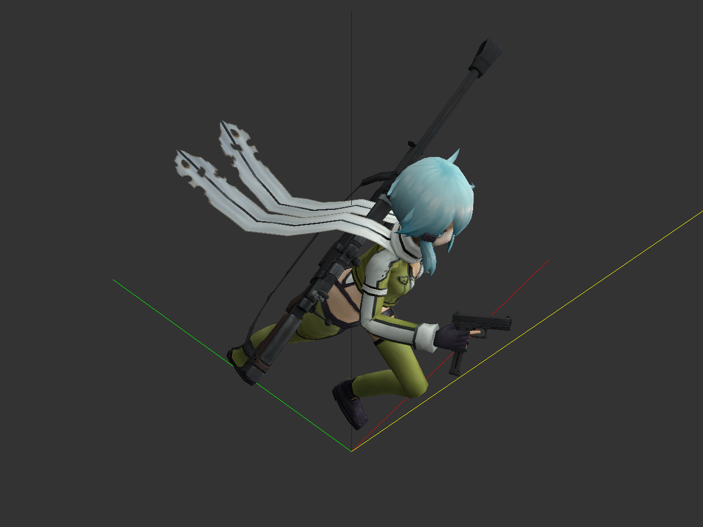

需要注意的是，如果未勾选“是否为特效”，那么勾选此选项仅能够形成二值化的透明通道（即要么完全透明，要么完全不透明，无法做到半透明）。仅可用于上图类似的情景。

### 双面渲染

为了节省计算资源，所有网格的背面在一般情况下是不进行渲染的，这导致我们观察一些单面网格的背面时会出现透明的效果。在我们需要背面也进行渲染时，便需勾选双面选项。

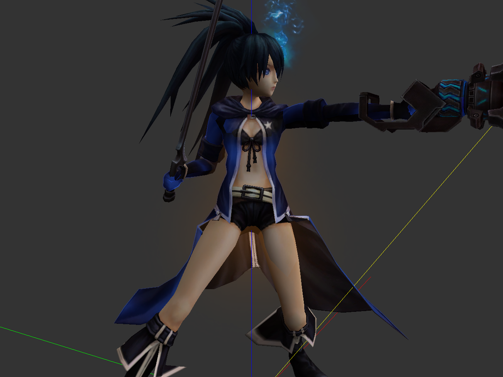
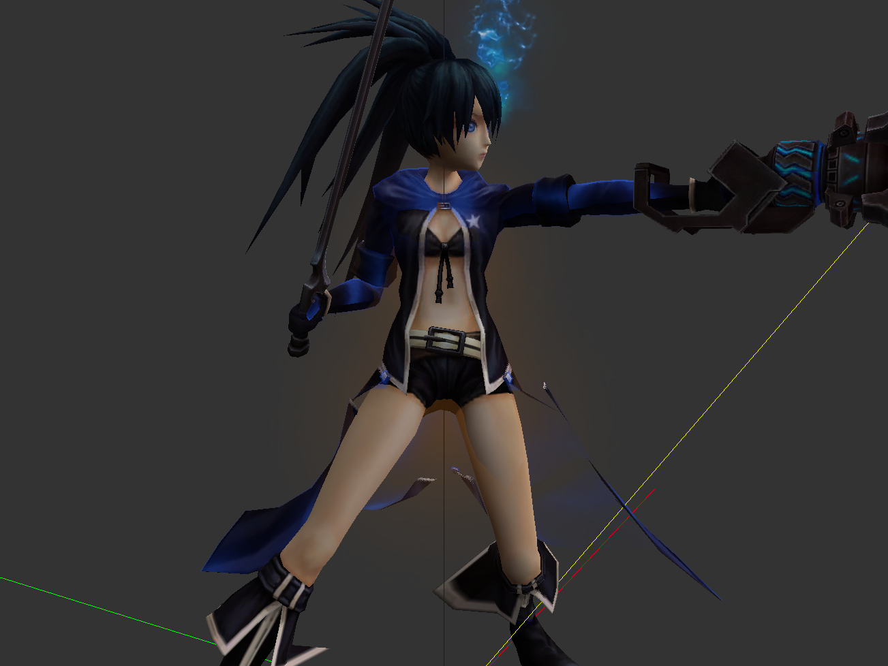

效果对比，注意黑岩的风衣下摆

### 加法混合

对应旧版编辑器的“黑色透明”。使用OpenGL的加法混合模式，勾选之后黑色部分会被特效识别为透明通道，未勾选则反之。制作黑色半透明特效即从此处入手。

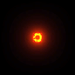
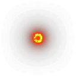

### 不计算光照

勾选后网格不参与光照计算。

### 写入深度缓冲

勾选后，即使已勾选“Alpha混合”也会写入深度缓冲，使半透明网格完全遮挡住后面的模型。

### 限制UV

对应旧版编辑器的“仅在UV变换时显示”。每个材质都保存有贴图坐标变换（即UV变换）的动画数据，此选项用于一些特殊的攻击特效（桐子平A特效，亚里亚近程平A特效，赵云Q特效等），旧版的翻译并不准确，其实际效果是使网格UV值超过规定范围（0，1）时，使网格隐藏。

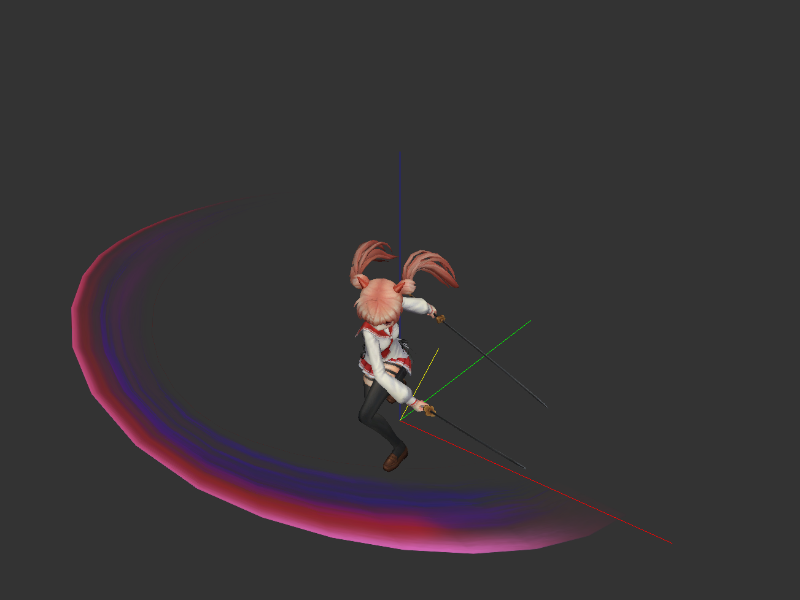
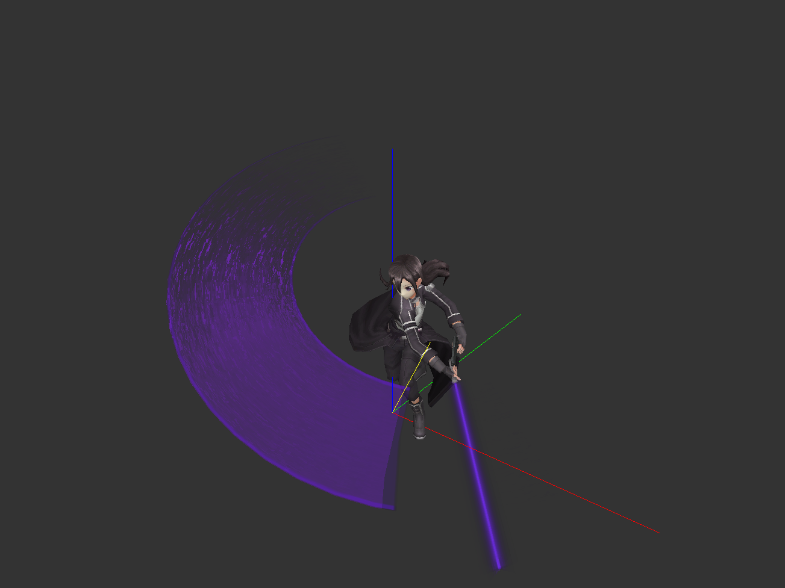

### UV偏移

不同于保存在材质UV动画中的变换数据，此项参数指定了网格的贴图坐标以一恒定的速度进行平移，用于制作人物身上的流光效果（黑岩二段W，黑叔暴击等）。无论是否为特效网格都可使用。为1.0时即为每秒循环回到初始位置，其他数值以此类推。

### UV分块

可以使网格拥有类似粒子序列的效果。

### 颜色动画

UV分块下方的颜色框是材质颜色动画的预览，从左到右、从上到下展示了材质颜色的全部变化过程。点击即可取色，注意此处不能修改颜色，需修改颜色请用材质列表上方的颜色按钮。

### 凹凸特效

勾选后可以为材质指定凹凸贴图（法线贴图，`..\data\magic\textures\zheshe\`下的贴图，通常以蓝色为主，包含少量红色与绿色）。通常与折射脚本`|MA:REFRACTION`联合使用，使网格具备折射特效，能够产生类似光线折射、空气扭曲的效果。用于很多英雄特效的制作。具体请参考桐人W、黑岩W等。折射特效生效需要在游戏设置中勾选后期处理选项，否则不会生效（最高画质下默认启用）。

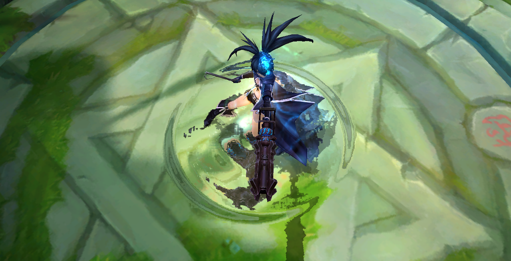

### 高光特效

勾选后可以为材质指定高光贴图（通常为黑白色贴图）。能够在模型特定区域产生能够随观察角度变化而变化的亮区效果。具体请参考桐人衣服的材质。

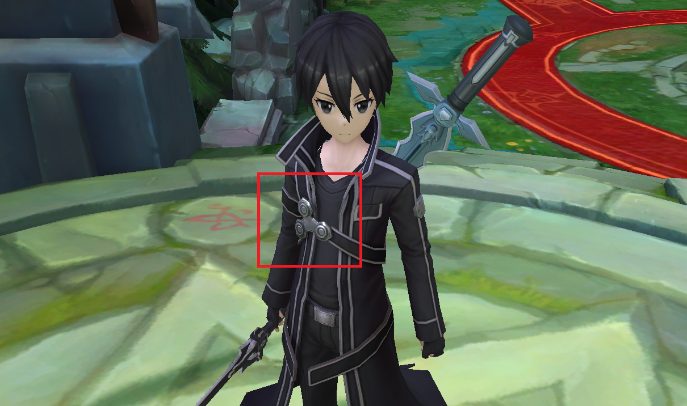

### 光照贴图

勾选后可以为材质指定光照贴图（通常主体为绿色，包含少量红色和蓝色）。用于微调网格的光照效果。

### 卡通渲染

启用卡通渲染需要指定两张贴图：一张高光贴图（通常主体为绿色，包含少量红色和蓝色）用于控制亮部与暗部划分，一张阴影贴图（通常由与材质贴图颜色相近的色块组成）控制暗部的阴影颜色。具体参数效果还需测试。

### 溶解特效

指定一张溶解贴图，使网格中颜色值小于一定阈值的部分隐藏。注意使溶解生效需要额外的阈值动画数据，目前无法编辑。具体参数效果还需测试。

### 设置颜色

使用“颜色”按钮可以设置材质颜色。此项设置改变的是动画数据，意味着材质每一帧都可以有不同的颜色，但通过编辑器只能设置一种颜色。如需设置每一帧的颜色需要使用3ds Max。此项设置将与贴图颜色叠加（RGB通道分别相乘）决定模型的最终颜色。要使此项设置产生效果需要修改网格中的“标志”选项为“变换颜色”。

## 网格

### 网格名称

此项设置没有特别的要求，但是注意有些名称的网格会只在特定情况下显示（如黑岩二段W的流光，小暗大招的翅膀等）。这些网格名称多以`_hide`结尾，具体需要查询哪些网格有特殊显示条件请在dat中查询。

### 根骨骼

对应旧版编辑器“显示骨骼”。每根骨骼都保存有显示动画数据（决定每一帧是否显示）。这些数据可以为网格所使用，使其在特定的帧数显示或隐藏（如十香大招武器的切换就是用骨骼实现）。如果导出的模型有些网格莫名其妙地不显示，请检查网格名称与显示骨骼的帧数。要修改这些数据请看骨骼部分讲解。

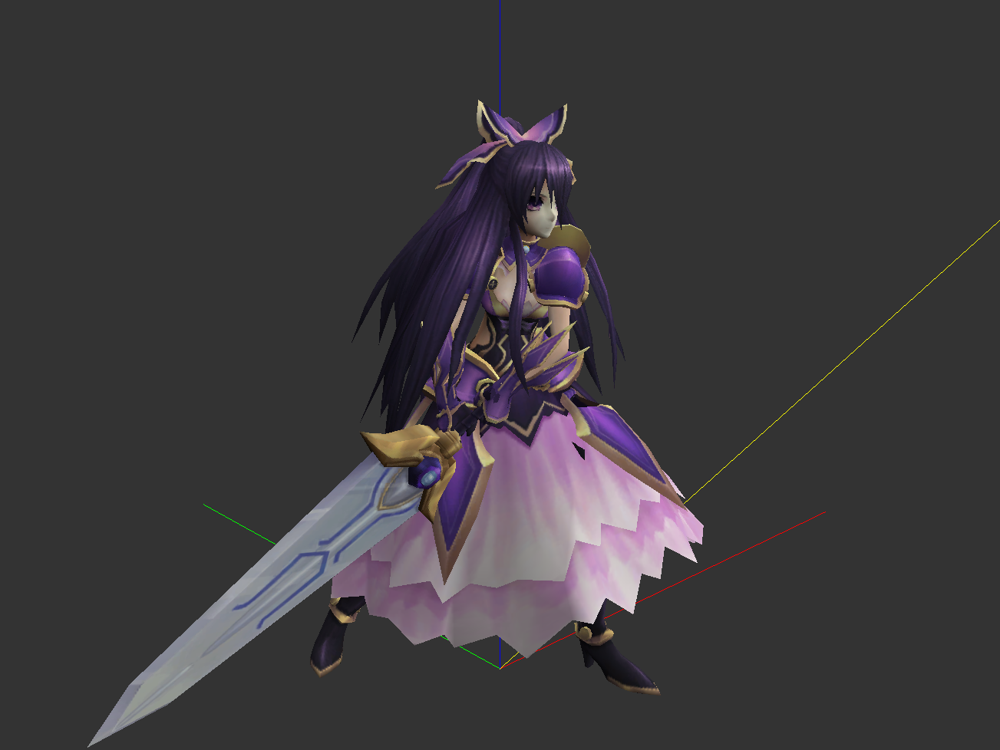
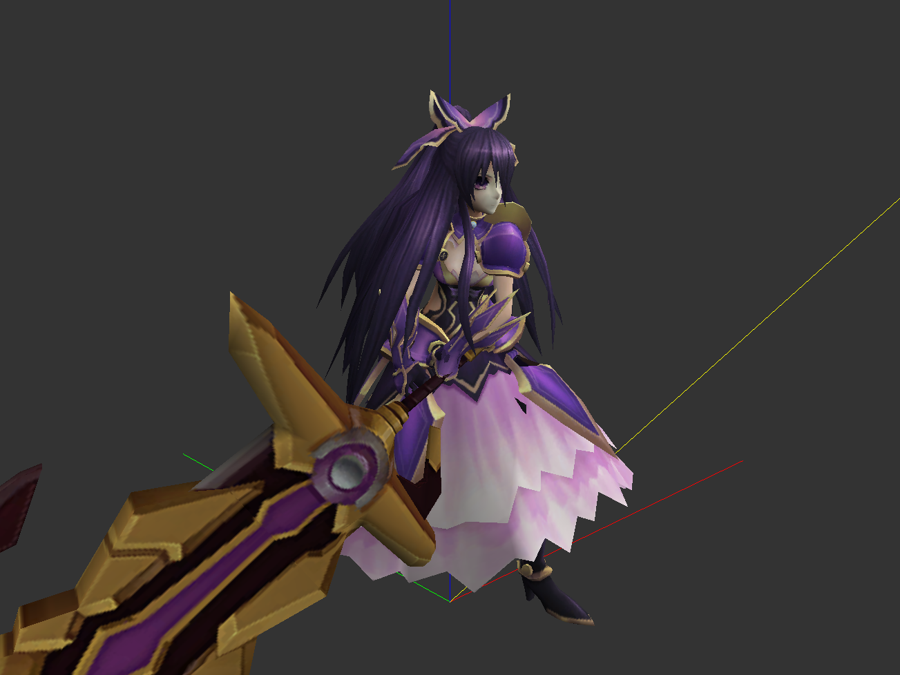

### 点面数量

这部分可以看到每个网格的顶点数量与三角面数量。需要注意的是这些数字与导出前3ds Max统计的数字并不一定相同，因为三维软件内的面一般并非三角面，还受到平滑等修改器的影响，导出后点面数量可能会翻几倍。

由于X文件格式的限制，单个网格的顶点数量不可超过32767，一般情况下建议整个人物模型的顶点和面总数不超过1万左右，否则会出现帧率降低、加载卡顿等问题。如果实在需要更高的点面数量，请将模型拆分为多个网格。

### 网格类型

对应旧版编辑器“标志”。常见值如下：

- 固定颜色：忽略材质动画数据中的颜色数据，使用贴图颜色。
- 固定方向：需要与“始终向上”或”垂直地面“联合使用。
  - 当勾选“始终向上”时：使网格永远朝上，即平行与地面。
  - 当勾选“垂直地面”时：使网格垂直于地面，同时正面朝向摄像机。
  - 当均不勾选：使网格如同粒子一样，每个面都朝向玩家的视角而不是跟随角色转动（如小圆魔女皮肤手腕和肩上宝石的光芒）。
- 变换颜色：使用材质动画数据中的颜色数据，显示材质与贴图颜色的叠加。
- 地面、碰撞箱：在少部分文件中出现（地图模型，幻刺的模型），一般不会使用。

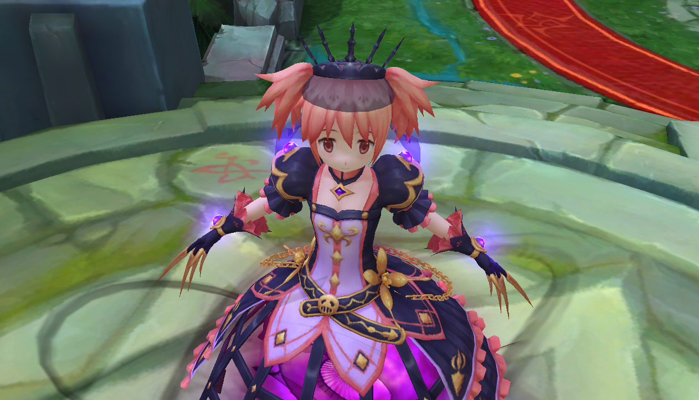
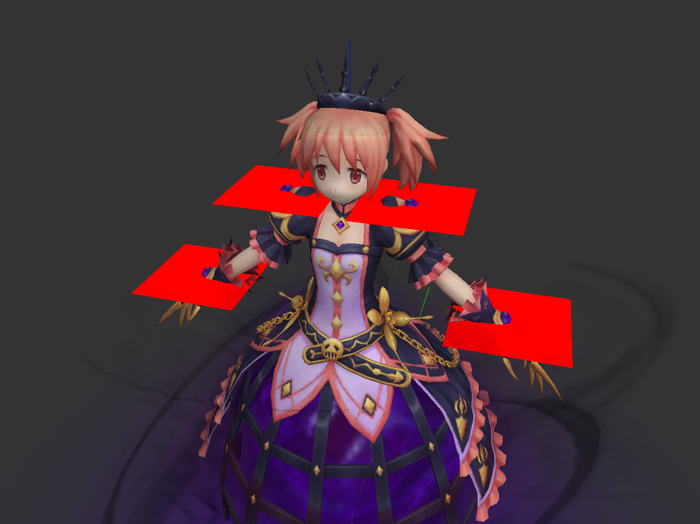

### 脚本

游戏内很多网格都带有脚本这一参数，出现过的脚本总数并不多，但其中很多都尚不清楚其具体作用。一个网格可以有多个脚本，用回车隔开，一行一个。常见的脚本包括：

* `|RF:NLIGHT`：隔绝光照效果对此网格的影响，始终显示最明亮的状态，多见于有自发光属性的特效网格。实际上基本所有用于特效的网格都有此脚本，如果觉得有些特效网格很暗，不妨试试这个脚本。
* `|MA:REFRACTION`：折射脚本，为需要产生折射效果的网格添加此脚本才能使对于材质的更改生效，需要开启后期处理。
* `|MA:EMISSIVE`：泛光脚本，为网格较亮的部分周围产生柔和的光亮，需要开启后期处理。不过这种方式产生的光晕小到难以察觉，制作泛光更好的方式是用十字交叉网格制作。

其他出现过但是不清楚具体作用的脚本：

* `|GE:ONFLOOR`
* `|RF:DEPTHFIRST`
* `|RF:FIXEDSCALE`
* `|RF:NSHADOWCACHE`
* `|RO:4`
* `|MO:PERFRAME`
* `|MO:RANDOMFRAME`

部分未出现过但是可以猜测其效果的脚本：

* `|RF:ONLYCASTSHADOW`：只产生阴影，不渲染网格本体。
* `|RF:NCASTSHADOW`：不产生阴影，只渲染网格本体。
* `|RF:NRECEIVESHADOW`：不接收其他网格产生的阴影。

对于一般的补丁制作，只需要为所有的特效网格添加`|RF:NLIGHT`脚本即可。

完整的脚本列表可以查看群文件。所有脚本的效果在编辑器内均无法预览，需进入游戏查看。

### 翻转法线

顾名思义，有时导出bug会使某些网格的法线方向全部反转，此功能可以调整网格的法线方向。

### 上移与下移

上移和下移能够调整某个网格在列表中的位置，看似并没有什么作用，但是网格在列表中的顺序恰恰就是其在游戏中的渲染顺序，对于一些特效文件而言，可以通过调整网格顺序来修正一些禁用深度缓存的网格的遮挡关系。

### 调整网格显示帧数的三种方式

1. 使用显示骨骼方式。用3ds Max设置某一根骨骼的显示帧数动画，然后将网格的显示骨骼设为此骨骼。
2. 使用材质透明度动画。材质的颜色动画不仅包含RGB通道，还包含透明通道。材质的透明通道也会对网格的显示造成影响，但是需要将网格的标志设为变换颜色。
3. 使用材质贴图坐标动画。详情见材质的“仅在UV变换时显示”参数。

以上三种设置网格在特定帧数显示的方式，第一种可在编辑器内完成，方法见骨骼参数详解。后两种仅能使用3ds Max生成，但是第二种可以做到让网格逐渐隐藏逐渐显现，实现透明度的渐变，而其余两种无法做到。