# 粒子与飘带参数

教程仅讲解各个参数单独作用的效果，各种组合效果还请各位补丁作者自行修改测试。

## 粒子系统

粒子是整个X文件中最复杂，也是最强大的一部分内容，作为网格特效的辅助元素，不同粒子的搭配可以做出无数种独特的效果（~~同时其可修改参数也多得令人发指~~）。下图为选中粒子后的预览结构，由一条绿色线段、一条蓝色线段、四条红色线段代表粒子发生器，由十字形状代表发射的粒子。旧版本的编辑器中，部分粒子的方向会有显示错误，新版本已经修复。

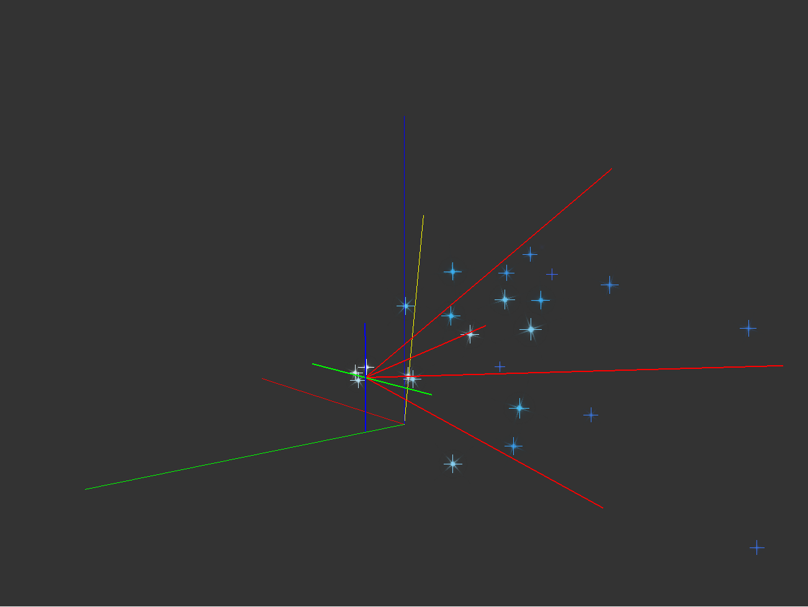

### 粒子名称

没有特殊要求，需要注意的是与网格一样，特定名称的粒子会有特定的显示条件，这些特殊的名字多以`_hide`为后缀。同时，粒子名称也可以容纳一个脚本，可以参照伊莉雅马猴烧酒皮肤的翅膀粒子。

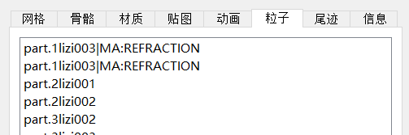

### 喷射

对应旧版编辑器“一闪即逝”。正常粒子在绑定骨骼可见的帧数都会发射新粒子，但勾选了这一项则只在绑定骨骼每次由不可见变为可见的那一帧，发射“发射数量”个新粒子。

### 使用模型坐标

对应旧版编辑器“跟随角色移动”。指示粒子在发射之后是否与绑定骨骼保持相对位置。勾选则粒子发射之后仍会跟随绑定的骨骼进行运动，与骨骼保持相对变换（包括位置，方向，大小）；反之则与骨骼无关，向固定方向进行移动。图示为黑岩奔跑动画时火焰粒子跟随角色移动的开启与关闭效果。

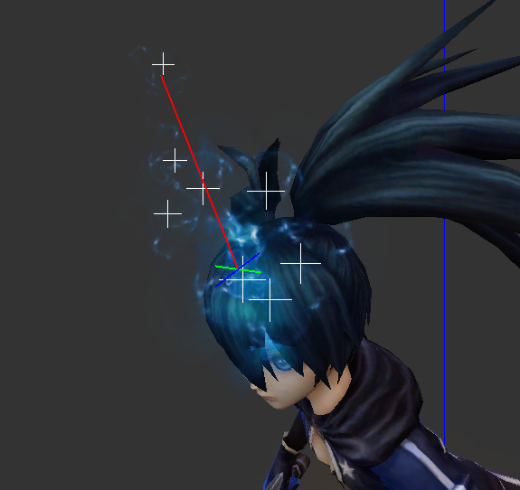
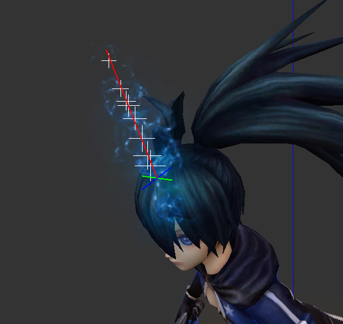

### 始终向上

对应旧版编辑器“不朝向摄像机”。类似于网格使用“固定方向”且勾选“始终向上”的效果，使粒子始终朝上，平行于地面。

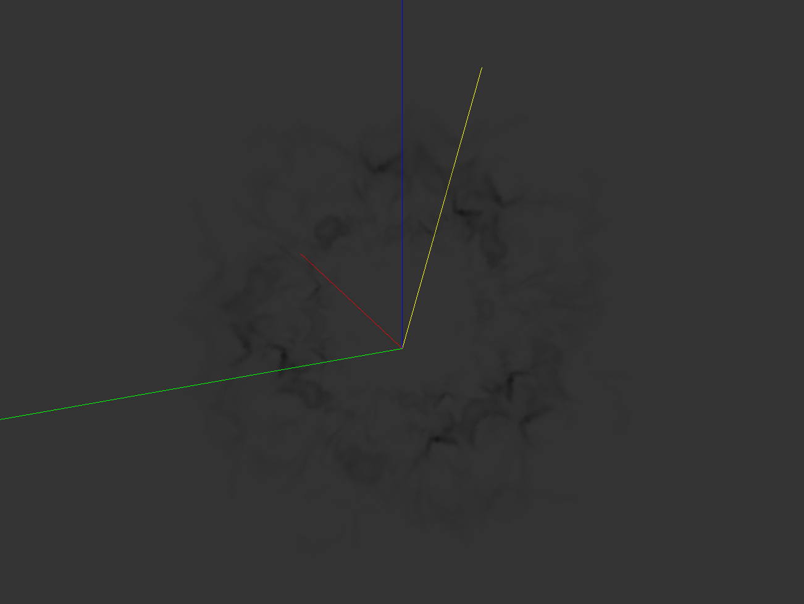
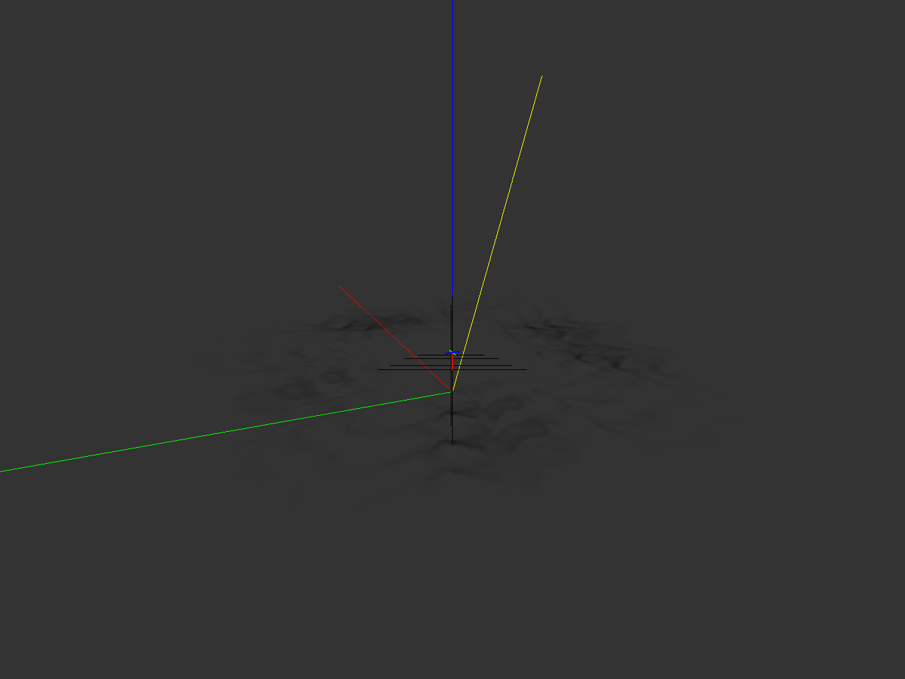

### 固定位置

对应旧版编辑器“绑定到骨骼”。勾选后粒子将不会移动。图示为其开启与关闭效果。

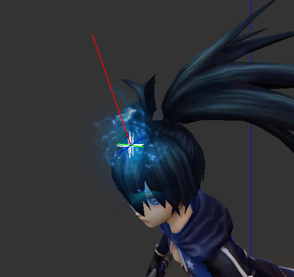

### 跟随平面移动

勾选后，粒子将仅在粒子平面（由粒子的绿色X轴与蓝色Y轴构成的平面）中移动，不会沿红色轴（粒子发射方向）移动。

### 写入深度缓冲

类似于材质“写入深度缓冲”，勾选后将使半透明的粒子也能够遮挡其后方的物体。

### 朝向移动方向

对应旧版编辑器“贴图方向放射”。开启后，粒子贴图将指向粒子的发射方向，用于射线状的粒子制作。图为贴图方向放射的开启与关闭效果。可以与尾迹模式配合使用。启用尾迹模式时，尾迹长度可以分别调整粒子沿发射方向开始、结束时的长度。尾迹速度目前作用不明。

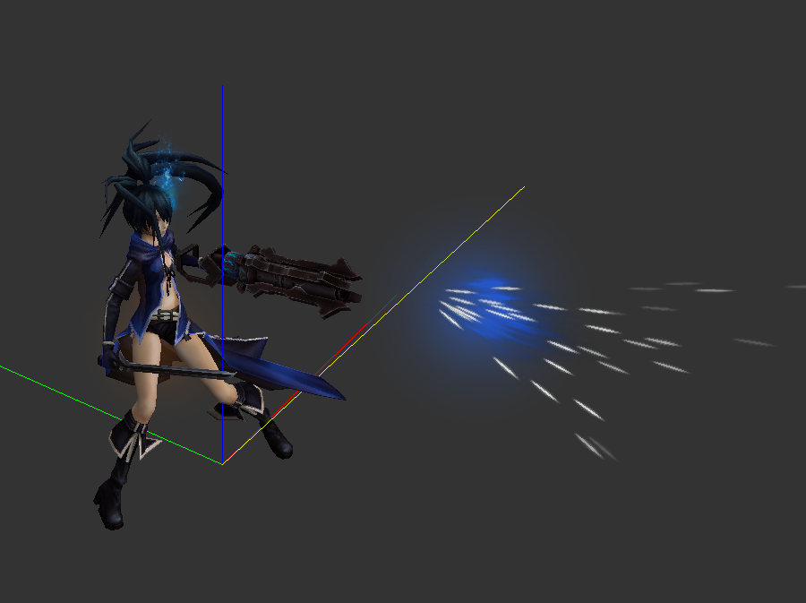
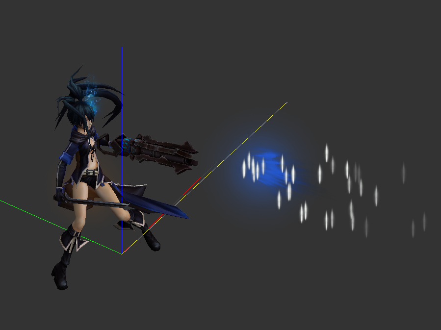

### 加法混合

对应旧版编辑器“黑色透明”。类似材质的“加法混合”，勾选后会将贴图的黑色部分替换为透明，这是黑色粒子会透明的原因。勾选之后黑色部分会被游戏识别为透明通道，未勾选则反之。制作黑色半透明粒子即从此处入手。

### 移动速度

对应旧版编辑器“发射速度”。前一个参数为粒子的基础发射速度，反映为粒子预览结构中红色线段的长度。后一个参数为在发射速度基础之上的随机量，例如填写100和50就代表实际的发射速度在（100±50%）之间随机产生，单位为单位长度/秒。

### 随机角度

带有限制的随机发射方向，反映为粒子预览结构中四条红色线段的夹角，单位为度。实际的发射方向将在四条红色线段组成的圆锥体中随机产生。此项与前方介绍的“随机发射方向”参数无法共同作用。

### 粒子重力

调整粒子X、Y、Z方向的移动加速度。

### 生命周期

粒子从发射到消失经过的时间，单位为秒。可与随机生命周期配合使用，如设置随机周期为0.8、1.2，则每个新生成的粒子的生命周期在80%~120%生命周期中随机选择。

### 发射数量

对应旧版编辑器“粒子数量”。每秒新发射的粒子个数。

### 随机偏移

粒子的发射起点并不是固定的一个点，而是由粒子预览结构中，蓝绿线段所构成平面内的随机点。平面的大小由蓝绿线段的长度所决定，即为随机偏移的两个参数。即使不需要粒子的随机偏移，也不要在此处填写0，可以填写0.1这种比较小的数字让随机偏移不明显。填写0会造成意想不到的BUG。

### 粒子序列

有些粒子的贴图并非单一贴图，而是多个图片序列组成的短动画（这一类贴图存放于`..\data\magic\textures\xulie\`文件夹内。例如下面组成黑岩左眼火焰的粒子贴图序列：

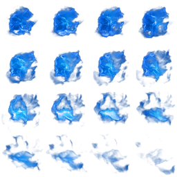

对于这一类的粒子，我们需要启用贴图序列的两个参数，填写粒子贴图横向与纵向的分段数量。以上图为例，横纵向的分段数量均为4。如此设置完毕之后，粒子便会自动播放贴图序列组成的短动画。当未勾选“序列对应生命周期”时，粒子使用的帧数将随时间增大，其增长速度由“序列帧率”决定。若勾选，则增长速度由粒子的生命周期决定，在整个生命周期中播放完整的序列动画。循环次数可以使序列动画播放多次。

### 过渡周期

粒子颜色与大小的变化分为三个阶段：开始、中间和结束，其对应的时间分别为0、过渡周期、粒子的生命周期。对于一个新创建的粒子，其颜色与大小均为第一项数值。从创建到达到过渡周期之前，其颜色与大小逐步变化为第二项数值。达到过渡周期之后和达到其生命周期即将消失前，其颜色与大小逐步变化为第三项数值。

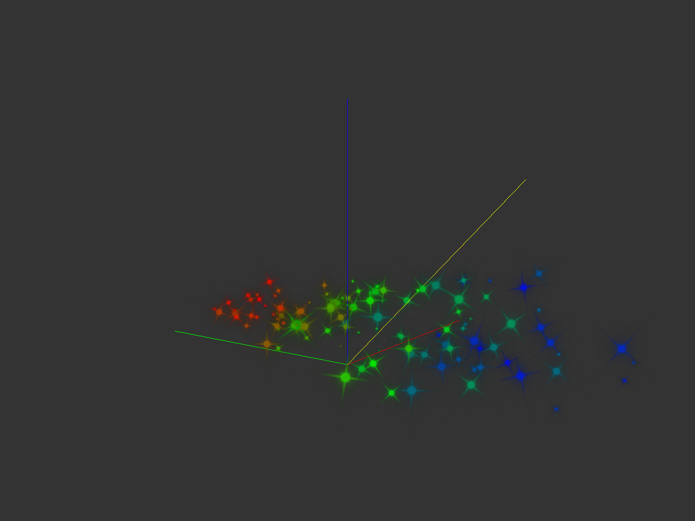

### 旋转角度

粒子的初始旋转角度，通常仅使用第三项，使粒子贴图在平面内旋转。

### 旋转速度

粒子的初始旋转速度。

### 随机角度

用于调整粒子的初始旋转角度，第一行为随机的最小值，第二行为最大值。

### 随机速度

用于调整粒子的初始旋转速度，第一行为随机的最小值，第二行为最大值。

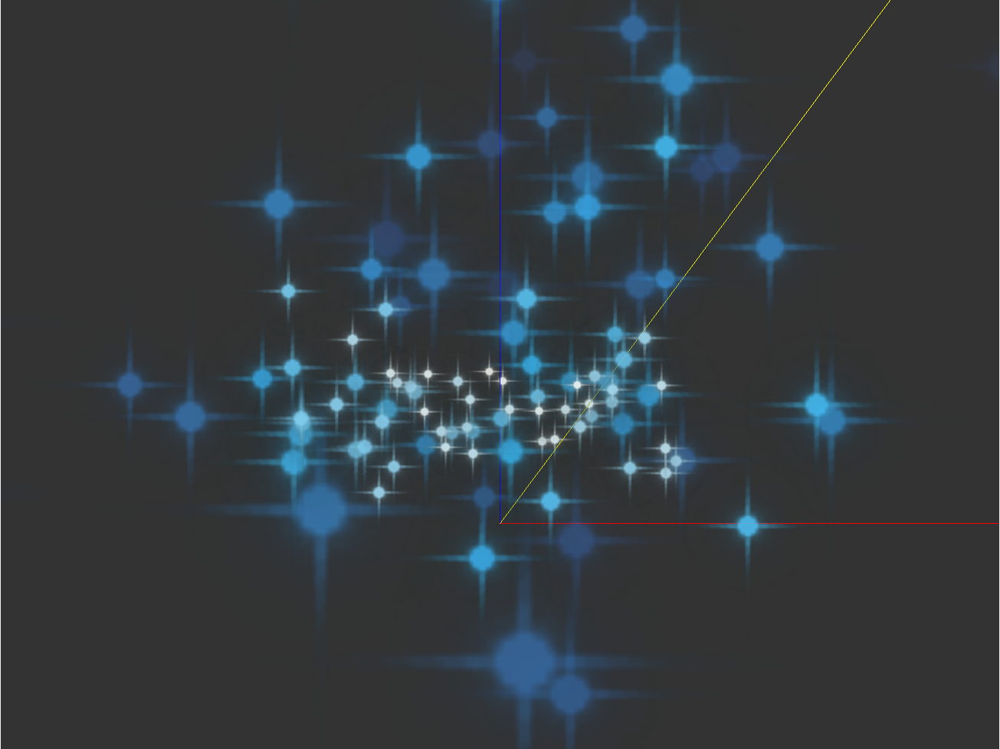
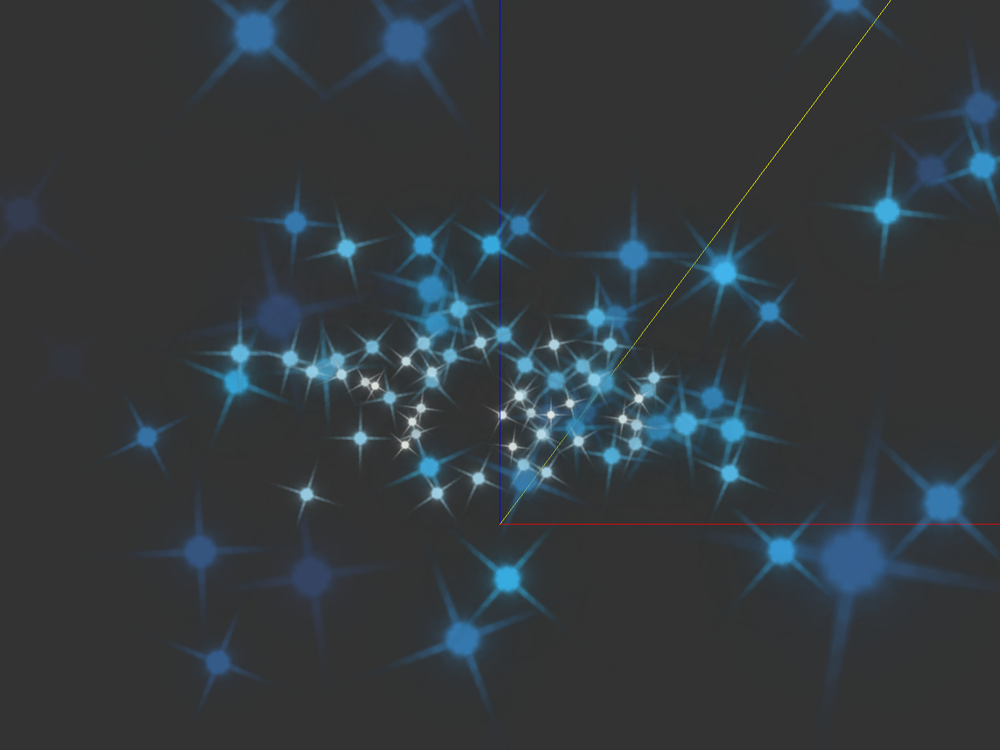

### 随机大小

此项设置了发射的粒子是否会以随机大小出现。需与下方的“随机大小”参数相配合，指定粒子大小的上限与下限，新粒子的大小将在此区间内随机产生，1.0即为原本的粒子大小。例如设置为0.5和1.5，则会将粒子大小在0.5倍与1.5倍之间随机。

此处的粒子大小倍数会与下方的“粒子大小”参数相乘获得实际显示的粒子大小。图示为粒子大小在0.1和2.0区间内随机的效果。

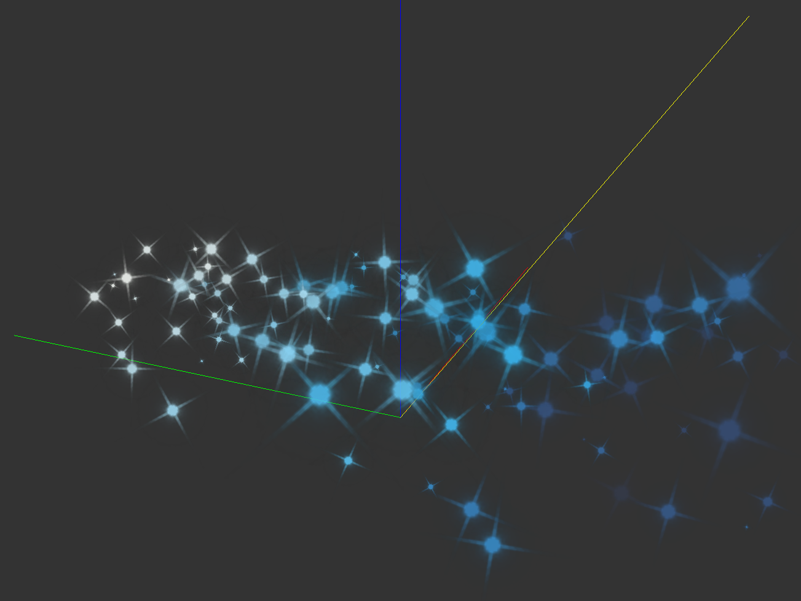

### 后期特效与脚本

与材质的参数相似，请参考材质章节的此部分内容。不同的是粒子无法制作高光特效，只能制作折射特效，具体可以参照伊利亚魔法少女皮肤的翅膀。制作折射特效还需要给当前粒子添加折射脚本，粒子的名称也可以附带一个脚本。

## 飘带

对应旧版编辑器的“尾迹”，为了与粒子的“尾迹”区分而改名。

### 加法混合

对应旧版编辑器的“黑色透明”（~~不用再说一遍了吧，讲过两遍了都~~）。

### 飘带名称

同样遵从某些特殊名称的特殊显示条件。

### 飘带分段和飘带长度

分段数越高，尾迹便越平滑。需要注意的是这两个参数的乘积最大是20，超过20之后尾迹不会再变长。尾迹分段的最小值是4，填写小于4的值产生的也是等于4的效果。

### 分段上限

飘带分段乘以飘带长度的上限，最大为20。

### 颜色

旧版编辑器将红色和蓝色通道显示颠倒了，新版中已经修复。四个参数分别为尾迹颜色的BGRA值，将与尾迹的贴图颜色叠加得到实际显示的颜色。