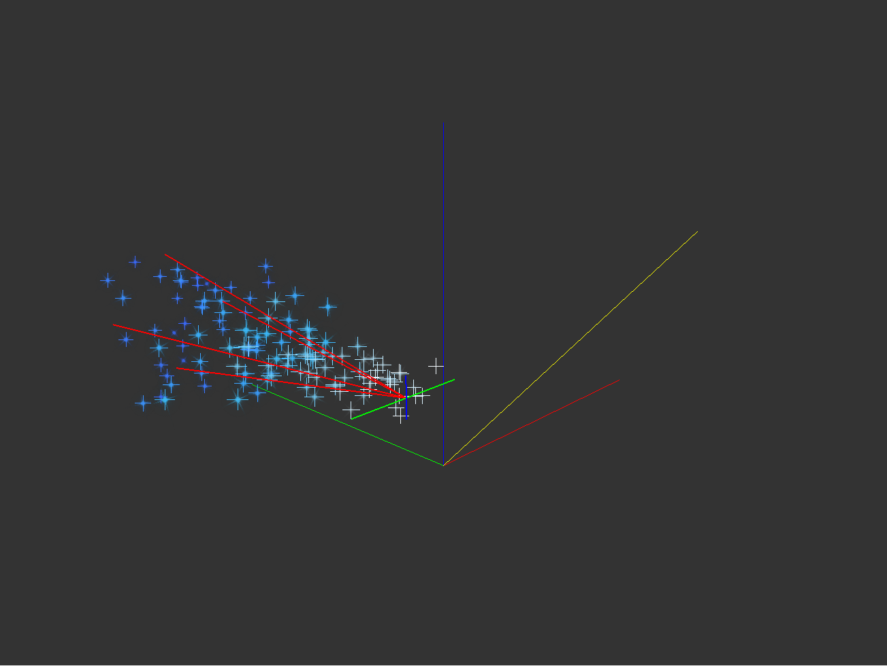
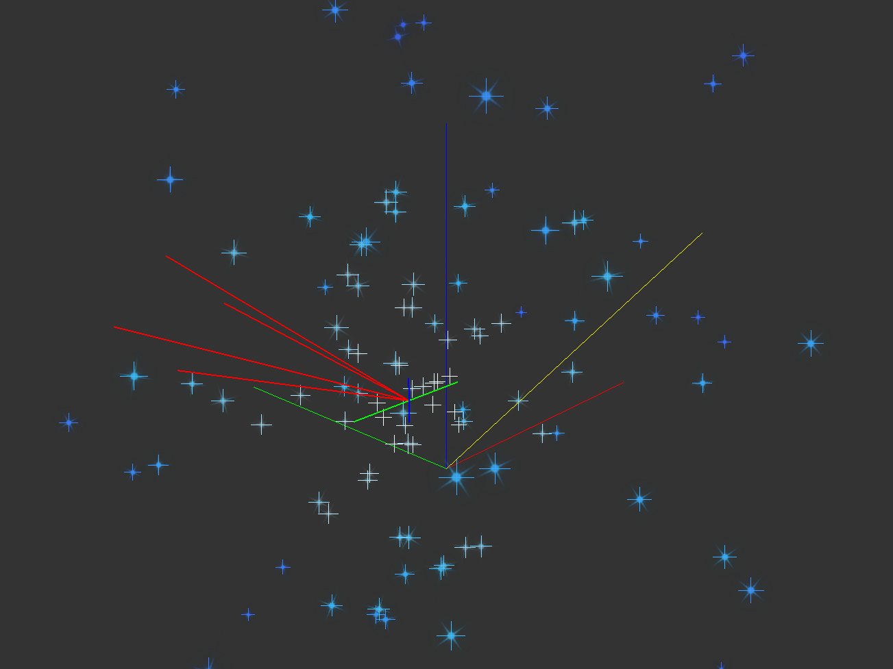

# 粒子与尾迹参数

教程仅讲解各个参数单独作用的效果，各种组合效果还请各位补丁作者自行修改测试。

## 粒子系统

粒子是整个X文件中最复杂，也是最强大的一部分内容，作为网格特效的辅助元素，不同粒子的搭配可以做出无数种独特的效果（~~同时其可修改参数也多得令人发指~~）。下图为选中粒子后的预览结构，由一条绿色线段、一条蓝色线段、四条红色线段代表粒子发生器，由十字形状代表发射的粒子。旧版本的编辑器中，部分粒子的方向会有显示错误，新版本已经修复。

### 粒子名称

没有特殊要求，需要注意的是与网格一样，特定名称的粒子会有特定的显示条件，这些特殊的名字多以`_hide`为后缀。同时，粒子名称也可以容纳一个脚本，可以参照伊莉雅马猴烧酒皮肤的翅膀粒子。

### 跟随角色移动

指示粒子在发射之后是否与绑定骨骼保持相对位置。勾选则粒子发射之后仍会跟随绑定的骨骼进行运动，与骨骼保持相对坐标；反之则与骨骼无关，向固定方向进行移动。图示为黑岩奔跑动画时火焰粒子跟随角色移动的开启与关闭效果。

### 绑定到骨骼

开启后，发射的粒子会时终保持与骨骼的相对位置不变（与重合不同），不会相对骨骼进行移动。图示为绑定骨骼的开启与关闭效果。

### 贴图方向放射

开启后，贴图的上方将指向粒子的发射方向，用于射线状的粒子制作。图为贴图方向放射的开启与关闭效果。

### 不朝向摄像机

正常情况下，粒子系统发射的粒子都是面向着玩家观察视角的。通过这个选项，我们可以指定它面向的方向不是玩家视角，而是其自身发射粒子的方向。图示为此选项开启与关闭的效果。

### 随机发射方向

360度无死角全方位打击！图示为随机发射方向开启与关闭效果。

### 黑色透明

对于粒子，游戏默认便会将贴图的黑色部分替换为透明，这是黑色粒子会透明的原因。勾选之后黑色部分会被游戏识别为透明通道，未勾选则反之。制作黑色半透明粒子即从此处入手。

### 随机贴图方向

与随机发射方向类似，这次随机的是贴图方向！图示为随机贴图方向开启与关闭效果。在参数调整窗口中部还有一个贴图随机方向，这个是针对序列贴图的随机方向（~~虽然不明白为什么会有两个随机贴图方向，但是只要两个同时都修改应该就没问题了吧！~~）。

此项设置需与下方的“随机方向”参数相配合，此参数默认为360，即为360度内随机生成贴图方向。可以修改此数值以限制贴图随机的角度。

### 一闪即逝

此项设置与粒子绑定骨骼的显示帧数相关。正常粒子在绑定骨骼可见的帧数都会发射新粒子，但勾选了这一项则只在绑定骨骼每次由不可见变为可见的那一帧发射新粒子。

### 随机粒子大小

此项设置了发射的粒子是否会以随机大小出现。需与下方的“随机大小”参数相配合，指定粒子大小的上限与下限，新粒子的大小将在此区间内随机产生，1.0即为原本的粒子大小。例如设置为0.5和1.5，则会将粒子大小在0.5倍与1.5倍之间随机。

此处的粒子大小倍数会与下方的“粒子大小”参数相乘获得实际显示的粒子大小。图示为粒子大小在0.1和2.0区间内随机的效果。

### 发射速度

前一个参数为粒子的基础发射速度，反映为粒子预览结构中红色线段的长度。后一个参数为在发射速度基础之上的随机量，例如填写100和50就代表实际的发射速度在（100$\pm$25%）之间随机产生，单位为单位长度/秒。

### 随机角度

带有限制的随机发射方向，反映为粒子预览结构中四条红色线段的夹角，单位为度。实际的发射方向将在四条红色线段组成的圆锥体中随机产生。此项与前方介绍的“随机发射方向”参数无法共同作用。

### 生命周期

粒子从发射到消失经过的时间，单位为秒。

### 粒子数量

每秒新发射的粒子个数。

### 旋转速度

新发射粒子的初始贴图角度的旋转速度。可能会有点绕，等同于粒子发生器本身在旋转，新发射的粒子初始贴图角度由粒子发生器的角度决定。表现就是新粒子的初始贴图方向在不断旋转，单位为度/秒。具体可以参考`..\data\magic\common\ui\daqu\daquxuanze\`下的两个X文件。

### 随机偏移

粒子的发射起点并不是固定的一个点，而是由粒子预览结构中，蓝绿线段所构成平面内的随机点。平面的大小由蓝绿线段的长度所决定，即为随机偏移的两个参数。即使不需要粒子的随机偏移，也不要在此处填写0，可以填写0.1这种比较小的数字让随机偏移不明显。填写0会造成意想不到的BUG。

### 粒子序列

有些粒子的贴图并非单一贴图，而是多个图片序列组成的短动画（这一类贴图存放于`..\data\magic\textures\xulie\`文件夹内。例如下面组成黑岩左眼火焰的粒子贴图序列：

对于这一类的粒子，我们需要启用“X方向序列”与“Y方向序列”两个参数，并在“贴图序列”参数处填写粒子贴图横向与纵向的分段数量。以上图为例，横纵向的分段数量均为4。如此设置完毕之后，粒子便会自动播放贴图序列组成的短动画。新生成时的粒子将会播放第一帧并随时间推移逐步播放每一帧，在消失之前会播放到最后一帧动画。

### 粒子颜色

颜色参数分为三行三列，共九个数据，取值范围均为0~255。三列数据分别为粒子刚发射时、粒子生命周期过半时、粒子消失时的RGB颜色，其余时间的颜色将由这三个颜色过渡形成。例如下图中粒子由初始的红色过渡为绿色，再过渡为消失时的蓝色。

### 透明度

共三个数据，为粒子颜色的透明通道。同样分为粒子刚发射时、粒子生命周期过半时、粒子消失时共三个透明度，取值范围0~255。

### 粒子大小

共三个数据，同样分为粒子刚发射时、粒子生命周期过半时、粒子消失时共三个大小。

### 随机转动

两个数据分别为粒子转动速度的上限与下限，例如填写-3.0和3.0，则生成的粒子会在-3.0到3.0之间选择一个贴图转动速度，单位为度/秒。

### 后期特效与脚本

与材质的参数相似，请参考材质章节的此部分内容。不同的是粒子无法制作高光特效，只能制作折射特效，具体可以参照伊利亚魔法少女皮肤的翅膀。制作折射特效还需要给当前粒子添加折射脚本，粒子的名称也可以附带一个脚本。

（~~终于把这堆乱七八糟的参数介绍完了~~）

## 尾迹

### 黑色透明

（~~不用再说一遍了吧，讲过两遍了都~~）

### 尾迹名称

同样遵从某些特殊名称的特殊显示条件。

### 尾迹分段和尾迹长度

分段数越高，尾迹便越平滑。需要注意的是这两个参数的乘积最大是20，超过20之后尾迹不会再变长。尾迹分段的最小值是4，填写小于4的值产生的也是等于4的效果。

### 颜色

旧版编辑器将红色和蓝色通道显示颠倒了，新版中已经修复。四个参数分别为尾迹颜色的BGRA值，将与尾迹的贴图颜色叠加得到实际显示的颜色。