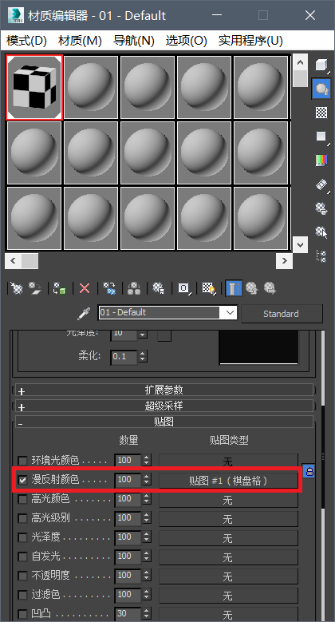
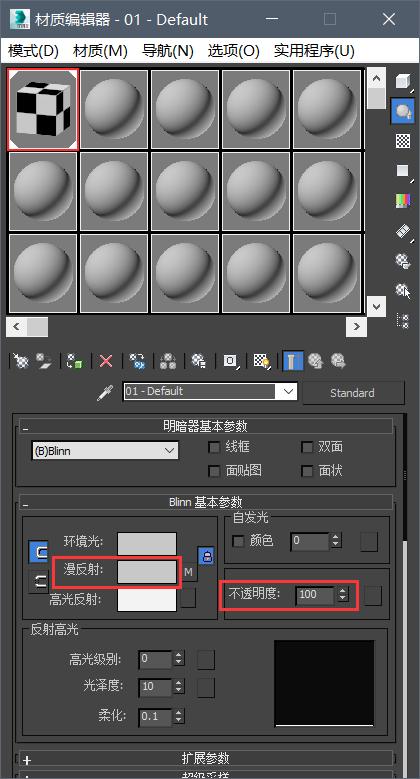
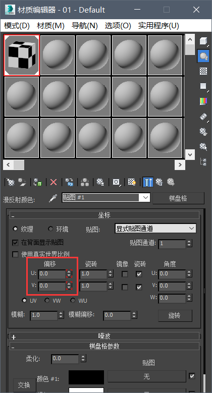
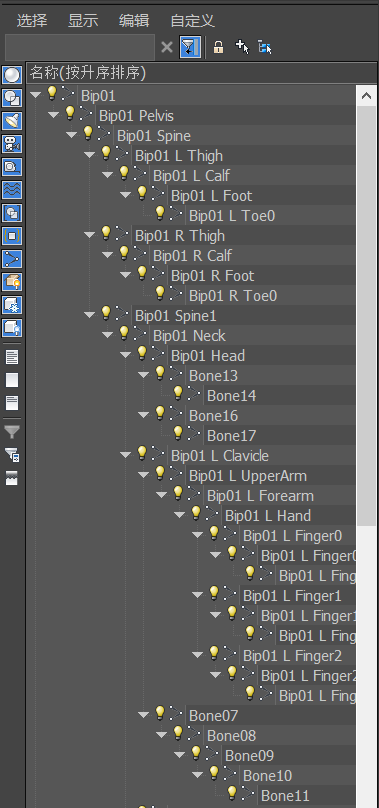
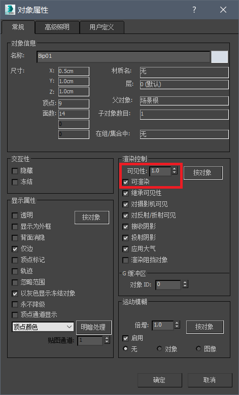
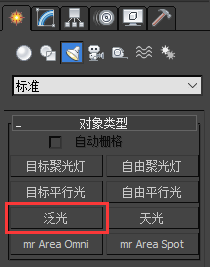
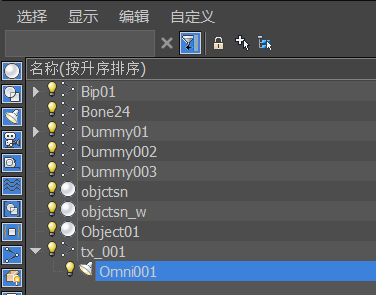
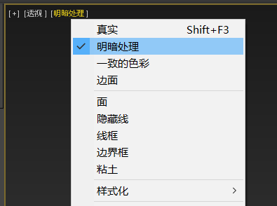
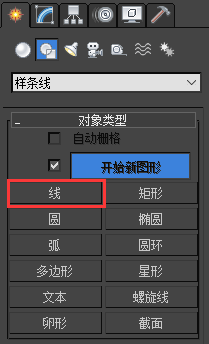
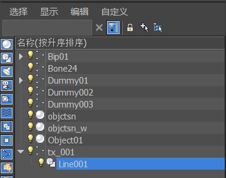

# 3ds Max相关内容

## 支持导出的数据

由于X文件格式支持的数据内容相当有限，绝大多数在3ds Max中的数据都无法导出至X文件。在此列出所有能够被X格式支持的模型数据。标注有“动画”的数据指这些数据可制作动画，在不同的帧数拥有不同的值。

导出后动画的总帧数便是3ds Max下方时间条的长度。可通过调节时间条来调整需要导出的帧数。

### 贴图

仅导出贴图文件名，不包含目录。

### 材质

* 所使用的贴图，编辑材质的漫反射贴图实现。
* 材质颜色（动画），RGB数据编辑漫反射颜色实现，透明度数据编辑不透明度实现。
* UV偏移（动画），编辑贴图的UV偏移实现。

所有数据均在材质编辑器中进行编辑，编辑贴图点击图一红框中的贴图名称即可。

### 骨骼

* 骨骼名称，人物模型需注意应以`Bip`为前缀。
* 骨骼间的父子关系，在层级编辑器中编辑。
* 骨骼的坐标变换（动画），包括平移、旋转、缩放变换。
* 骨骼的可见度（动画），仅有两种取值，可见和不可见。在右键骨骼的属性窗口中编辑，注意需要先勾选“可渲染”。可见性大于0.5为可见，小于0.5为不可见。

### 网格

* 网格名称。
* 所使用的材质。
* 模型数据（点面数据，法线数据，贴图坐标数据，蒙皮数据）。

注意只有位于最上层级的网格（即不是其他物体的子物体）才会被导出。即使网格并不需要骨骼动画，也必须添加蒙皮修改器，并添加至少一根骨骼。网格的材质需为标准类型，如果为“多维/子对象”类型的材质需要先将模型拆分，使每个网格只拥有一个标准类型材质。

注意对于骨骼数量较多的蒙皮网格，需要在蒙皮修改器的高级参数中将“骨骼影响限制”修改为4或更低，否则导出后可能产生模型扭曲的后果。

### 粒子

* 粒子名称。
* 粒子坐标与朝向。
* 绑定的骨骼。

在3ds Max中，粒子由灯光对象代替（灯光->标准->泛光）。要使一个粒子被导出，这个灯光需要被设为某一根骨骼的子对象，在层级编辑器中拖动完成。位于最上层级的灯光将被忽略。

如果不喜欢灯光产生的明暗效果，可以在显示窗口中将显示方式调整为“明暗处理”。

### 尾迹

* 尾迹名称。
* 绑定的骨骼。
* 起始点与终止点。

尾迹由仅有两个点的样条线对象代替（图形->样条线->线）。同样，要使尾迹被导出，需将样条线设置为某一根骨骼的子对象。

## X格式转换FBX

导入FBX时设置的注意事项：勾选填充时间表，选择转换为骨骼，调整单位为厘米。