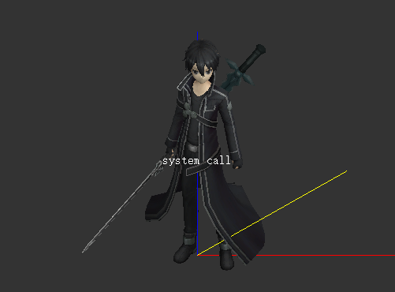

# 编辑器的指令系统

刀剑神域第三季的System Call是不是很帅呀！（此章节仅供娱乐）

## 指令的输入

点击编辑器的预览窗口以调整焦点，然后切换英文输入法即可输入指令，回车即可执行！

如果指令输入错误不会有任何提示，为了还原原著（~~其实就是懒~~）。

## 指令能做什么

编辑元素，保存文件，为多数现有的编辑操作提供了另一种调用方法（~~当然不用指望解放鼠标只用键盘操作了，因为这些指令实在是太太太太TMD长了~~）。

## 指令的格式

所有的指令都以`system call`为前缀，之后才是指令本体。目前的所有指令如下所示。

* `system call change field attribute XXX`

	- 调整部分元素的显示状态。其中的`XXX`可以为 `axis`、`bone`、`frame`、`normal`、`texture`、`animation`中的一个，分别对应编辑器的”显示轴线“、“显示骨骼”、“显示线框”、“显示法线”、“显示贴图”、“播放动画”六个按钮。

* `system call enlight element object id XXX`

	- 选中名称为`XXX`的元素，网格、骨骼、材质、贴图、动画、粒子、尾迹均可选中。名称中包含空格的元素无法选中。

* `system call generate preserved gate zero XXX`

	- 打开四基佬的远古改模补丁制作教程，其中`XXX`可以为`one`、`two`、`three`、`four`中的一个。

* `system call generate XXX element form element discharge`

	- 创建一个新的元素。其中的`XXX`可以为`material`、`texture`、`animation`中的一个，分别对应于材质、贴图、动画。

* `system call manipulate element object id XXX YYY`

	- 对一个元素进行相应的操作，`XXX`即为元素的名称，网格、骨骼、材质、贴图、动画、粒子、尾迹均可。`YYY`为进行的操作，可以取如下的几个值：

    - `inspect`：编辑元素的参数。
    - `burst`：删除元素。
    - `reverse`：对于网格，进行翻转法线操作。对于尾迹，进行头尾反向操作。
    - `ascend`：仅对于网格，进行上移操作。
    - `descend`：仅对于网格，进行下移操作。
    - `change visibility`：仅对于骨骼，进行调整显示帧数操作。
    - `change appearance`：仅对于材质，进行设置颜色操作。

* `system call release core protection`

	- 退出编辑器程序。

* `system call transfer unit durability point XXX to YYY`

    - `left to self`：打开文件。
    - `self to left`：保存文件。
    - `right to self`：合并文件。
    - `self to right`：关闭文件。

